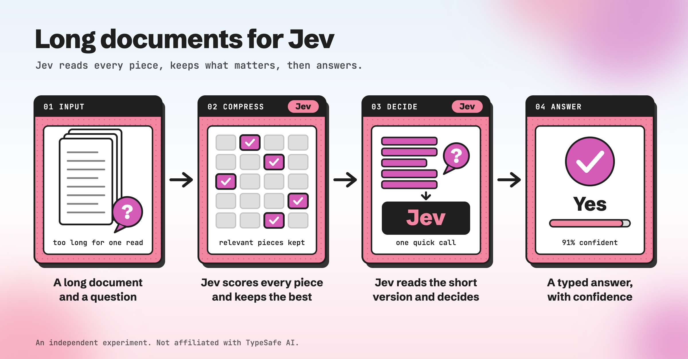

# longjev

Long inputs for [Jev](https://docs.typesafe.ai), TypeSafe AI's decision model.

Jev reads at most 32K tokens. `longjev` has the same call as Jev's `system_one(state, questions)` but
takes a state of any length: Jev scores every piece of the input, the best pieces are kept, and Jev
answers over what is left.

**Status: an experiment.** Independent work, not affiliated with TypeSafe AI.

## Quickstart

```bash
uv add git+https://github.com/avshalomd/longjev
export TYPESAFE_API_KEY=...   # or OPENROUTER_API_KEY, or AI_GATEWAY_API_KEY (Vercel)
```

Jev can be reached three ways. longjev uses the first provider whose key is set, in this order, unless
`LONGJEV_PROVIDER` or `LongJev(provider=...)` names one:

| Provider | Key | Notes |
|---|---|---|
| `typesafe` | `TYPESAFE_API_KEY` | TypeSafe's own API. It has no embeddings, so the `embed` and `embed_then_jev` selectors send their embeddings to OpenRouter or Vercel, whichever key is set. |
| `openrouter` | `OPENROUTER_API_KEY` | OpenRouter passes the request on to TypeSafe. |
| `vercel` | `AI_GATEWAY_API_KEY` | Vercel AI Gateway. It offers only an unversioned `typesafe-ai/jev`, so a pinned model version is not guaranteed. Its free tier is heavily rate-limited. |

All three list Jev at $0.042 per million input tokens.

```python
from longjev import LongJev, Choice, Noul

lj = LongJev()
result = lj.system_one(
    state=very_long_text,
    questions={
        "notice": Noul("Does the contract allow termination without notice?"),
        "law": Choice("Which law governs?", ["New York", "Delaware", "other"]),
    },
)
result.answers["law"].choice      # same fields as Jev's answers
result.long_input.kept            # which pieces were kept, with scores
result.long_input.sufficiency     # Jev's own view: was the kept text enough?
lj.close()
```

Inside Jupyter or other async code, use `await lj.asystem_one(state, questions)` and `await lj.aclose()`.

Options on `LongJev(...)`:

| Option | Default | What it does |
|---|---|---|
| `selector` | `"jev"` | What scores the pieces. See the table below. |
| `budget_tokens` | `16_000` | How much text the final call may read. |
| `max_budget_tokens` | `28_000` | Inputs estimated under this go to Jev whole. Also the ceiling when the budget widens. |
| `chunk_tokens` | `800` | Piece size. Bigger pieces mean fewer Jev calls. |
| `cache` | none | A path. Every request is cached there, so a rerun costs nothing. |
| `provider` | first with a key | `"typesafe"`, `"openrouter"` or `"vercel"`. See above. |
| `model` | `"typesafe/jev-1.13"` | The only Jev name OpenRouter accepts. `"typesafe/jev-latest"` works on the other two. |

## How it works

1. If the state and questions are estimated at under 28K tokens, they go straight to Jev. The estimate
   is 3 characters per token, which is wrong for Chinese or Japanese text; if Jev rejects the request as
   too long, the long-input path takes over.
2. Otherwise the state is cut into pieces.
3. A selector scores every piece for every question:

   | `selector=` | What scores the pieces |
   |---|---|
   | `"jev"` | Jev reads every piece, all in parallel, and answers "does this passage help answer the question?" |
   | `"embed_then_jev"` | An embedding model shortlists the top 25% of pieces (at least 40); Jev scores only those. |
   | `"embed"` | Embedding similarity only (`qwen/qwen3-embedding-8b`). |
   | `"truncate"` | Keeps the start and the end. |

4. The best pieces fill the token budget, go back into original order, and gaps are marked
   `[… about N tokens omitted …]`.
5. Jev answers the questions over that text, plus one extra question: is this text enough? If not, the
   budget widens once and Jev answers again.



## Where your data goes

The state is sent to TypeSafe, either directly or through OpenRouter or Vercel, depending on the
provider. With the `embed` selectors it is also sent to the embedding model on OpenRouter or Vercel; with
the `typesafe` provider that is whichever of those two has a key set. The optional cache stores Jev's
responses and embedding vectors on disk under a hash of the request, not the input text. The optional score log stores piece positions and scores, no text.

## Notes and credits

- The design is kept as written in `docs/superpowers/specs/`.
- `eval/` holds the benchmark scripts (LongBench v2, CUAD, Oolong). Their output stays local.
- Built with Claude Code. MIT licence.
